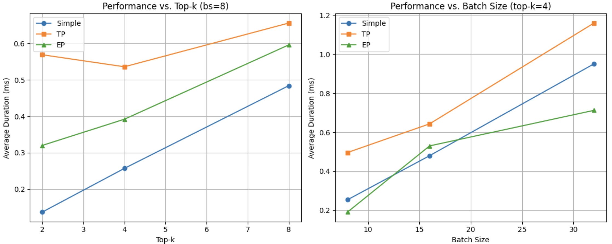
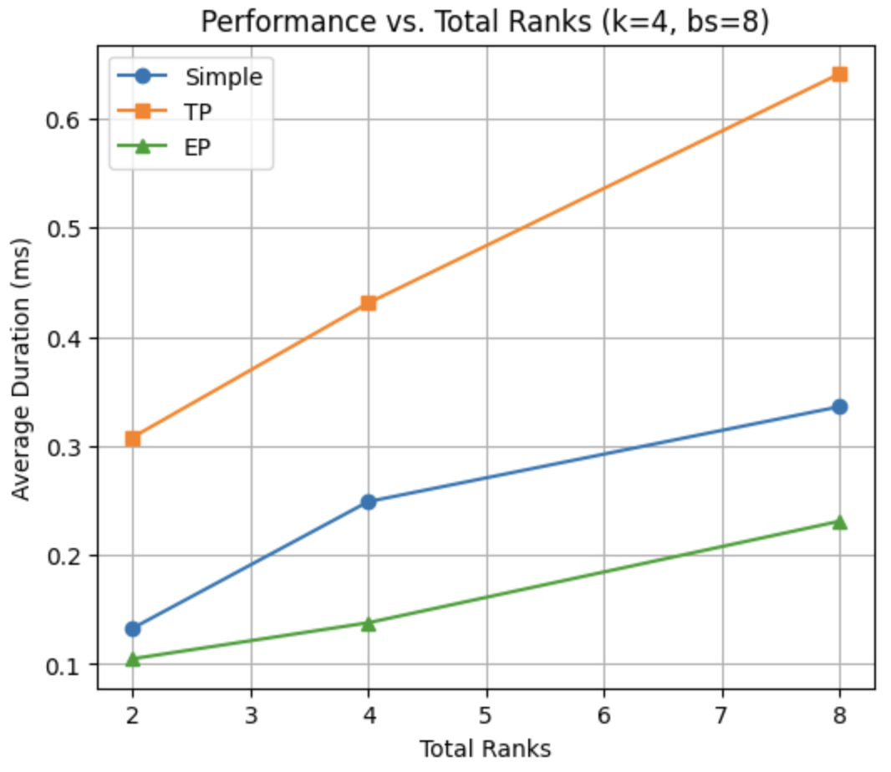
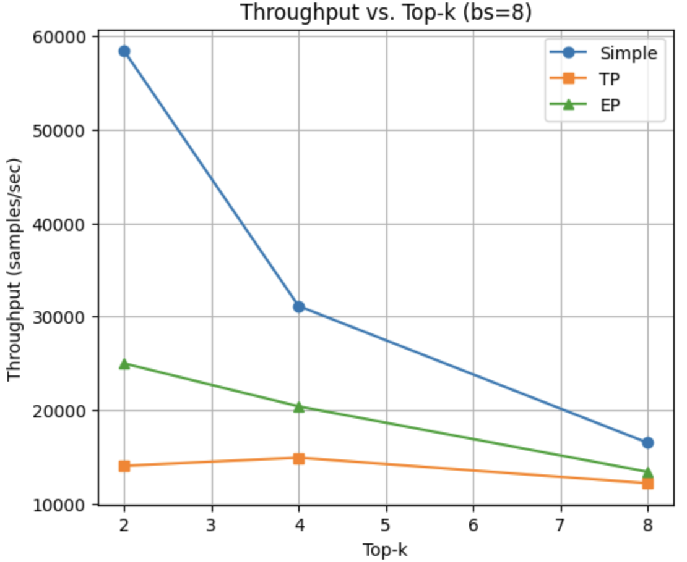
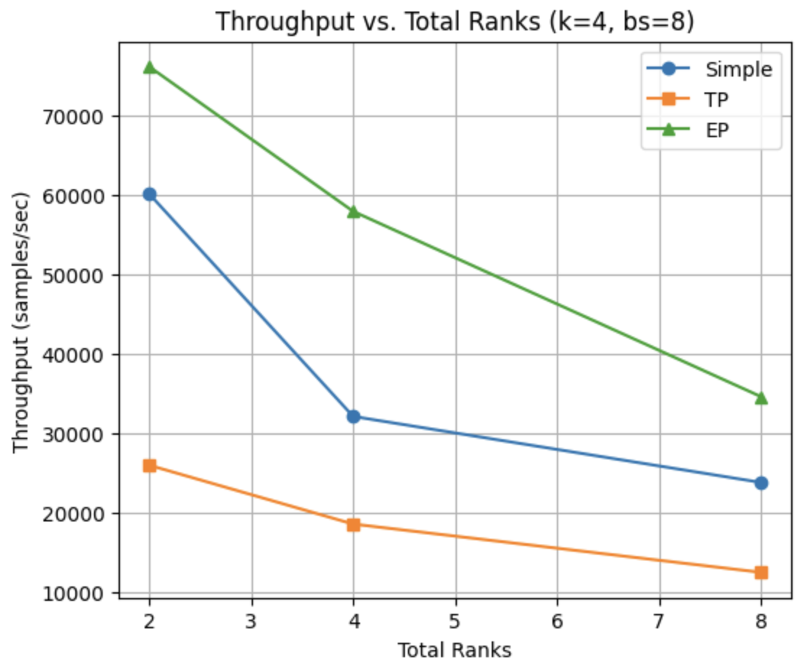

## Different Parallelization Strategies for MoE

I set N (number of runs) to 10 to ensure stable and consistent results. To benchmark my implementation across Simple, Tensor Parallel, and Expert Parallel MoE, I evaluate the **average duration** of the run and **average throughput** across varying **batch sizes**, **top-k** (k experts with the highest scores) values, and **total ranks** (devices).

`avg_throughput = batch_size / (avg_duration_ms / 1000)
`

Please note, in my implementation of **tensor parallel**, I split not only across the weights matrix (via ShardedLinear), but also split the batch-dimension across the processes, this especially works since we don't have non-linear activations and results in significant speedups compared to when we don't do batch-splitting. So, there are two communication taking place here: one is all-gather which collects these partial outputs of weights matrices from all processes and another is all-reduce .

### Benchmarking Average Duration
**Average Duration (ms), batch-size=8, #ranks=8**

| top-k | Simple | TP  | EP  |
|-------|--------|-----|-----|
| 2     | 0.137  | 0.569 | 0.32  |
| 4     | 0.257  | 0.536 | 0.392 |
| 8     | 0.484  | 0.656 | 0.596 |

**Average Duration (ms), top-k=4, #ranks=8**

| Batch Size | Simple | TP  | EP  |
|------------|--------|-----|-----|
| 8          | 0.254  | 0.496 | 0.191 |
| 16         | 0.48   | 0.643 | 0.53  |
| 32         | 0.95   | 1.159 | 0.712 |

**Average Duration (ms), top-k=4, batch-size=8**

Note here that total ranks represent total expert in our MoE.

| Total Ranks | Simple | TP  | EP  |
|-------------|--------|-----|-----|
| 2           | 0.133  | 0.308 | 0.105 |
| 4           | 0.249  | 0.431 | 0.138 |
| 8           | 0.336  | 0.641 | 0.231 |

### Benchmarking Average Throughput

**Throughput (samples/sec), batch-size=8, #ranks=8**
(Scaled to 10^3)

| top-k  | Simple | TP  | EP  |
|--------|--------|-----|-----|
| 2      | 58.39  | 14.05 | 25.00  |
| 4      | 31.13  | 14.93 | 20.41  |
| 8      | 16.53  | 12.20 | 13.42  |

**Throughput (samples/sec), batch-size=8, top-k=4** (Scaled to 10^3)

| Total Ranks | Simple | TP  | EP  |
|-----------|--------|-----|-----|
| 2         | 60.15  | 25.97 | 76.19  |
| 4         | 32.13  | 18.57 | 57.97  |
| 8         | 23.81  | 12.48 | 34.63  |

## Insights

- **Rank Scalability**: As we can observe, adding ranks increases execution time, but Expert Parallel scales most effectively, maintaining the lowest duration and highest throughput as ranks increase, especially for larger top-k values, making it ideal for large-scale distributed workloads..
- **Batch Size Effect**: Increasing batch size leads to higher execution time across all methods. Expert Parallel maintains lower latency than Simple at larger batch sizes, while Tensor Parallel remains the slowest.
- **Top-k Impact**: As top-k increases, execution time rises, with Simple having the highest speed, followed by Expert Parallel, while Tensor Parallel has the lowest execution speed.
